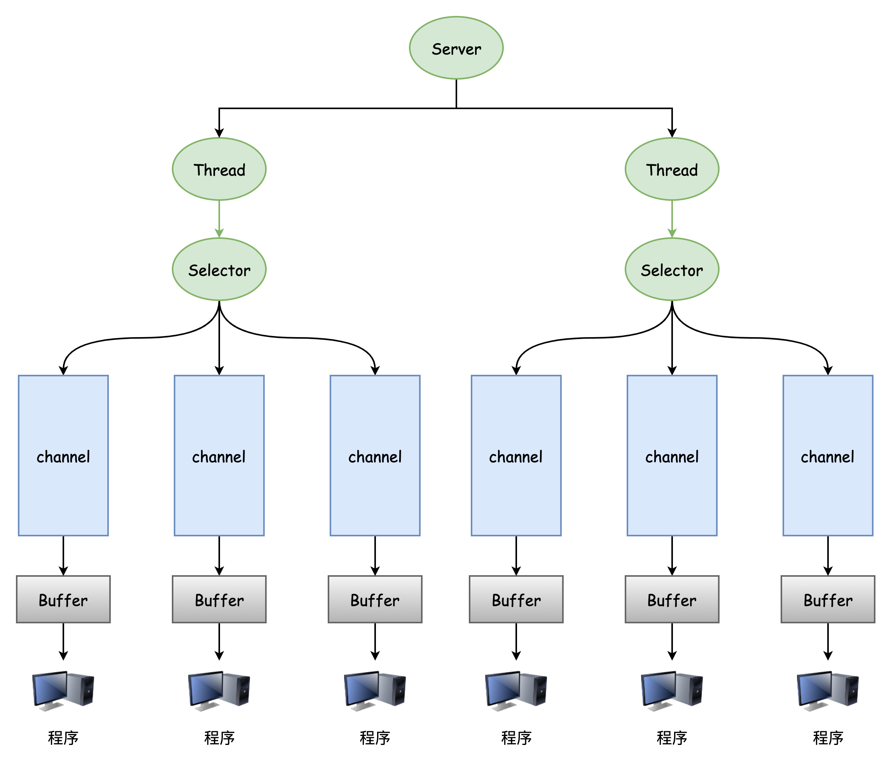
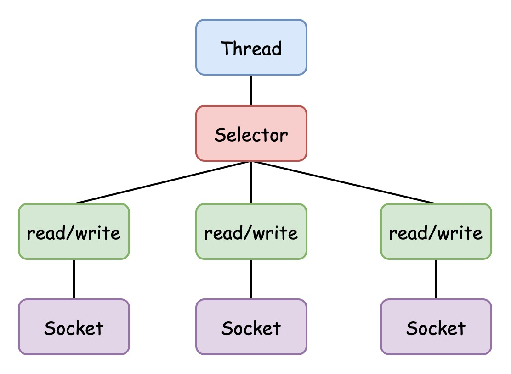

# Netty Project

Netty is an asynchronous event-driven network application framework for rapid development of maintainable high performance protocol servers & clients.

> Netty 源码编译，io.netty.util.collection包不存在解决方法
>
> cd common
>
> mvn clean install -DskipTests=true -Dcheckstyle.skip=true
>
> https://www.cnblogs.com/LiPengFeiii/p/16195549.html


## NIO

### NIO 三大核心组件原理示意图



1. 每个 channel 都会对应 一个 Buffer；
2. Selector 对应一个线程，一个线程对应多个 Channel（连接）；
3. 程序切换到哪个 Channel，是由事件决定的，Event 是一个重要的概念；
4. Selector 会根据不同的事件，在各个通道上切换；
5. Buffer 就是一个内存块，底层是一个数组；
6. 数据的读写是通过 Buffer 完成的，这个和 BIO 不同，BIO 中要么是输入流，要么是输出流，不能双向使用，但 NIO 中的 Buffer 是即可以读也可以写的，但需要使用 flip() 方法切换。Channel 也是双向的。


### Buffer

Buffer 类定义了所有的缓冲区都具有的四个属性，来提供关于其所包含的数据元素的信息：

```java
public abstract class Buffer {
    // Invariants: mark <= position <= limit <= capacity
    private int mark = -1;
    private int position = 0;
    private int limit;
    private int capacity;
}
```

| 属性     | 描述                                                         |
| -------- | ------------------------------------------------------------ |
| capacity | 容量，即可以容纳的最大数据量，在缓冲区创建时被设定，且不能改变 |
| limit    | 表示缓冲区的当前终点，不能对缓冲区超过极限的位置进行读写操作，且极限是可以修改的 |
| position | 位置，下一个要被读或写的元素的索引，每次读写缓冲区数据时都会改变值，为下次读写做准备 |
| mark     | 标记                                                         |


ByteBuffer 常用方法

```java
public abstract class ByteBuffer extends Buffer implements Comparable<ByteBuffer>{
    // 缓冲区创建相关 API
    // 创建缓冲区(指定初始容量)
    public static ByteBuffer allocate(int capacity);
    // 创建直接缓冲区(指定初始容量)
    public static ByteBuffer allocateDirect(int capacity);
    // 利用数组构建缓冲区
    public static ByteBuffer wrap(byte[] array);
    // 利用数组构建缓冲区，并使用构造初始化位置 offset 和上界 length
    public static ByteBuffer wrap(byte[] array,int offset, int length);
    
    // 缓冲区存取相关 API
    // 从当前位置 position 上获取数据，然后 position 的值会自动加一
    public abstract byte get();
    // 从绝对位置上获取数据
    public abstract byte get(int index);
    // 从当前位置上添加数据，然后 position 会自动加一
    public abstract ByteBuffer put(byte b);
    // 从绝对位置上添加数据
    public abstract ByteBuffer put(int index, byte b);
}
```


### Channel

#### Channel 的基本介绍

1. Channel（通道）类似于流，但有如下区别：
    - 通道可以同时进行读写，而流只能读或只能写；
    - 通道可以实现异步读写数据；
    - 通道可以从缓冲区中读数据，也可以向缓冲区中写数据。
2. BIO 中的 stream（流）是单向的，例如 FileInputStream 对象，只能进行读取数据的操作，而 NIO 中的 Channel（通道）是双向的，可以读操作，也可以写操作；
3. Channel 是 NIO 中的一个接口，其主要的实现类如下：
    - FileChannel：用于文件的数据读写；
    - DatagramChannel：用于 UDP 的数据读写；
    - ServerSocketChannel：用于 TCP 的数据读写，类似 **ServerSocket**，可以理解为 **server**
    -  SocketChannel：用于 TCP 的数据读写，类似 **Socket**，可以理解为 **Channel**


### Selector

#### Selector 基本介绍

1. Java 的 NIO 是非阻塞的 IO 方式，可以用一个线程，处理多个客户端的连接，使用到的就是 Selector（选择器）；
2. Selector 能够检测多个注册的通道上是否有事件发生（注意：多个 Channel 以事件的方式可以注册到同一个 Selector），如果有事件发生，便获取事件然后针对每个事件进行响应的处理，这样就可以只用一个线程去管理多个通道，也就是管理多个连接和请求；
3. 只有在连接/通道真正有读写事件发生时，才会进行读写，这样就大大地减少了系统开销，并且不必为每个连接都创建一个线程，不用去维护多个线程；
4. 避免了多线程之间的上下文切换导致的开销


#### selector示意图



1. Netty 的 I/O 线程 - NioEventLoop 聚合了 Selector(选择器，也叫多路复用器)，可以同时并发处理成百上千个客户端连接；
2. 当线程从某客户端 Socket 通道进行读写数据时，若没有数据可用时，该线程可以进行其他任务；
3. 线程通常将非阻塞 I/O 的空闲时间用于在其他通道上执行 I/O 操作，所以单独的线程可以管理多个输入和输出通道；
4. 由于读写操作都是非阻塞的，这就可以充分提升 I/O 线程的运行效率，避免由于频繁 I/O 阻塞导致的线程挂起；
5. 一个 I/O 线程可以并发处理 N 个客户端连接和读写操作，这从根本上解决了传统同步阻塞 I/O 一连接一线程模型，架构的性能、弹性伸缩能力和可靠性都得到了极大的提升。

> nio 内容不完整，待补充


## Netty

